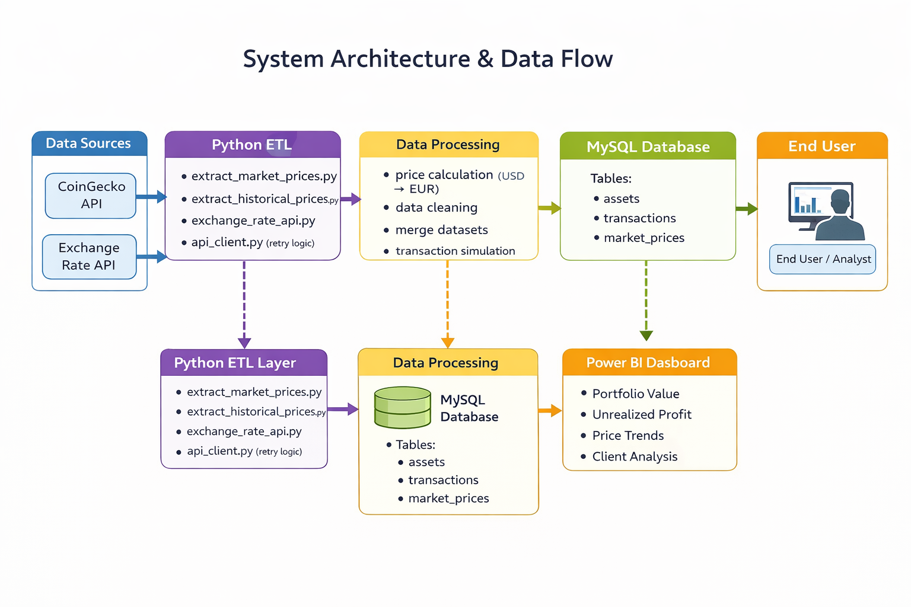
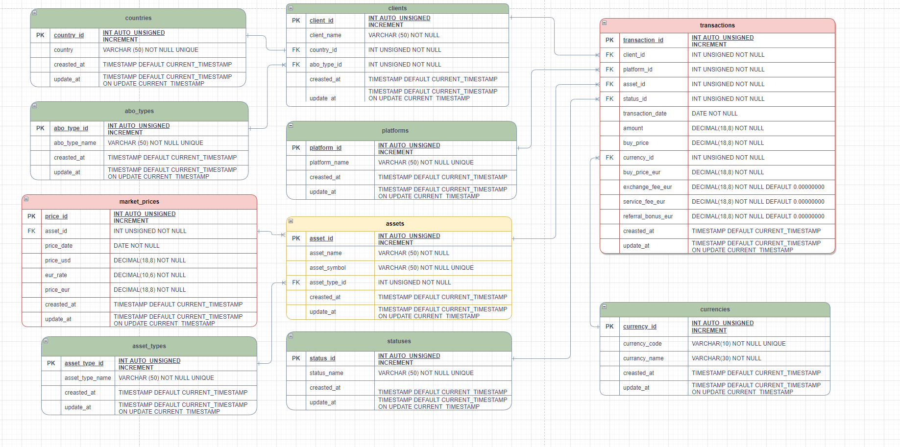
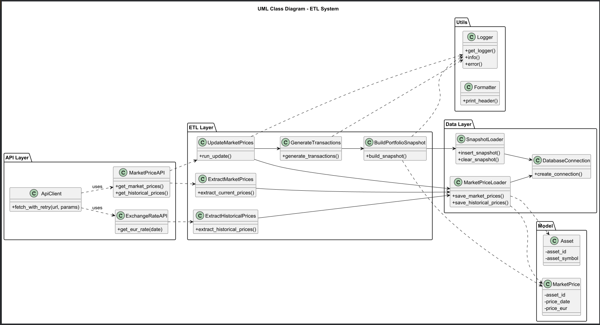
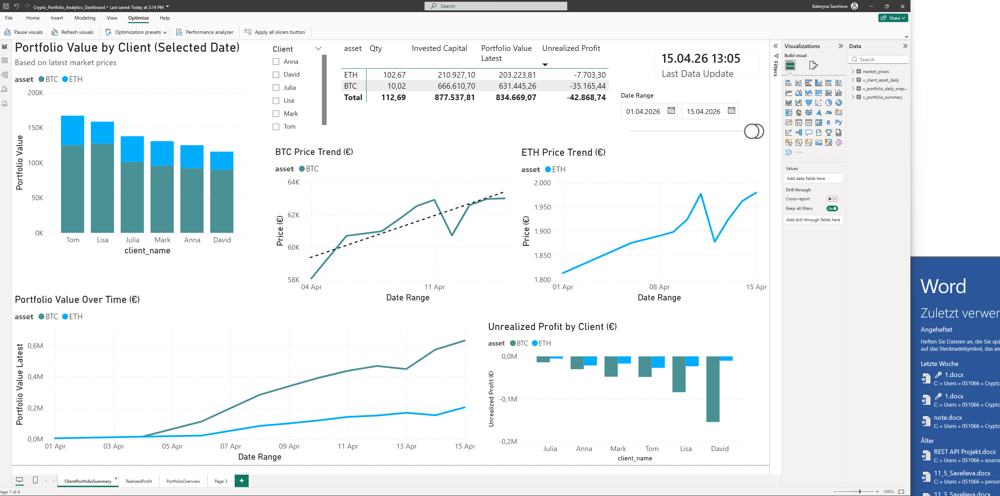
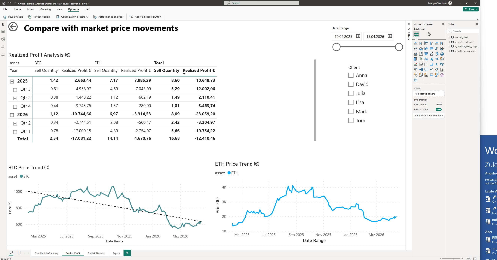
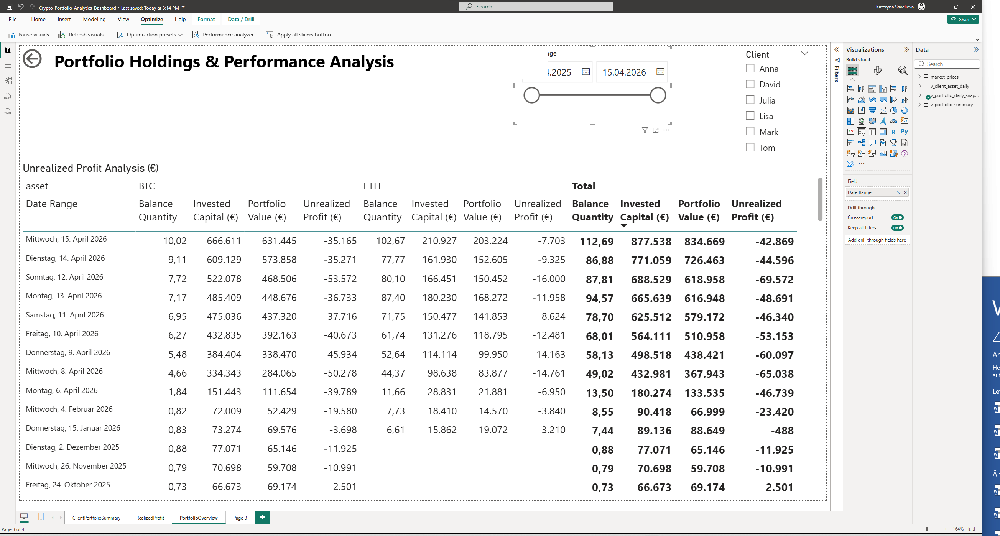

# 📊 Crypto Portfolio Analytics System

## 📌 About the project

This project is an **end-to-end data analytics system for cryptocurrency portfolios**.

It automatically loads market data from external APIs, processes it through an ETL pipeline, and transforms it into meaningful insights.

💡 The system simulates a realistic investment environment and demonstrates how raw data becomes structured analytics.

---

## 🧱 System Architecture



The system follows a classic ETL architecture:

- **Extract** → API data (crypto prices, exchange rates)  
- **Transform** → currency conversion, calculations, simulations  
- **Load** → MySQL database + analytics tables  
- **Visualize** → Power BI dashboards  

---

## 🗄️ Database Design (ERD)



✔️ Normalized MySQL schema  
✔️ Clear relationships between entities  
✔️ Designed for analytical queries  

### Key tables:

- `market_prices` → BTC & ETH prices  
- `transactions` → buy/sell operations  
- `portfolio_daily_snapshot` → calculated analytics  

---

## 🧠 System Design (UML)



The system is modular and structured into layers:

- API Layer (data fetching)  
- ETL Layer (processing logic)  
- Data Layer (database interaction)  
- Utility Layer (logging, helpers)  

---

## 🎯 Project goals

- Analyze cryptocurrencies (Bitcoin, Ethereum)  
- Work with real API data  
- Build an ETL process (Extract, Transform, Load)  
- Calculate portfolio metrics  
- Visualize data in Power BI  

---

## 🌐 Data sources (APIs)

- **CoinGecko API** → cryptocurrency prices  
- **Exchange Rate API** → USD → EUR conversion  

Data is fetched and processed regularly.

---

## 🔄 ETL Pipeline

Main script:

```bash
python run_current_pipeline.py
```


### Steps:
- Load market prices  
- Load exchange rates  
- Convert USD → EUR  
- Generate transactions  
- Create portfolio snapshot  
- Save data to database  

---

## 📊 Power BI Dashboard

### 📈 Portfolio Overview  


### 💰 Realized Profit Analysis  


### 📉 Holdings & Performance  


---

The dashboard includes:

- Portfolio Value  
- BTC / ETH price trends  
- Unrealized Profit  
- Realized Profit  
- Client-level analysis  

💡 Data is loaded directly from the database.

---

## 📈 Key metrics

- **Balance Quantity** → current holdings  
- **Average Buy Price** → average purchase price  
- **Book Value** → investment value  
- **Market Value** → current value  
- **Realized Profit** → profit from sales  
- **Unrealized Profit** → potential profit  

---

## 🛠️ Technologies used

- Python → ETL pipeline and data processing  
- Pandas → data transformation  
- MySQL → database  
- Power BI → visualization  
- Jupyter Notebook → analysis and testing  
- DBeaver → database management  
- Requests → API calls  
- Windows Task Scheduler → automation  

---

## ⚙️ Automation

- Scheduled pipeline execution  
- Regular data updates (e.g. every 2 hours)  

---

## ⚠️ Challenges & Solutions

- Fixed duplicate data issues in SQL views  
- Resolved aggregation mismatches in Power BI  
- Ensured consistency between transactions and portfolio snapshots  

---

## ▶️ How to run the project

### 1. Start database  
Run MySQL server  

### 2. Activate Python environment  

### 3. Run pipeline

```bash
python run_current_pipeline.py
```

## 🧠 What this project demonstrates

- ✔️ API integration  
- ✔️ ETL pipeline design  
- ✔️ Data modeling (SQL)  
- ✔️ Data validation & debugging  
- ✔️ Data visualization (Power BI)  

💡 This project represents a real-world data workflow.

---

## 👩‍💻 Author

**Kateryna Savelieva**  
Python | SQL | Data Analytics | ETL | Power BI  
